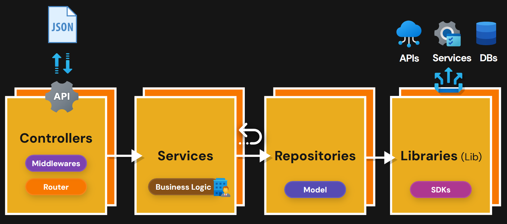

# Libraries

Conexión a SQL
SDK (Software develoment kit): Integración de las APIS.

# Repositories

Modelo: Accede a los datos y accede a las librerías

# Servicies

Lógica de negocio

# Controllers

Express, las routas y middlewares que envían y reciben JSONs.
