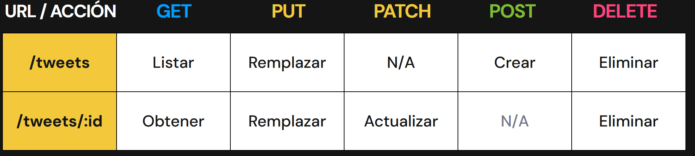

# CRUD

Create, Read, Update and Delete, son las acciones básicas que tiene una aplicación.

# RESTful

Es un estilo de arquitectura para sistemas distribuidos (comunicación cliente-servidor).
Obviamente no es la única posibilidad, existen otras como SOAP, GRAPHQL, archivos XML...

# Verbos

Existen más verbos, pero los de uso más común para indicar la acciones a realizar son:

