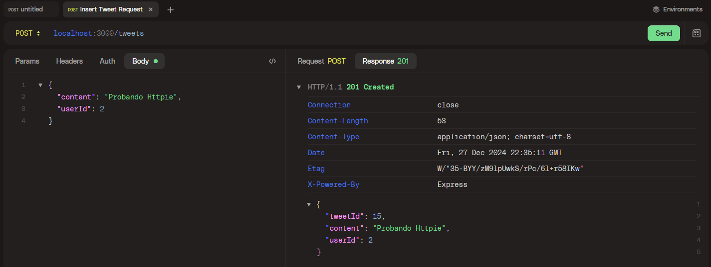

# CLI

Abrimos la **powershell** en modo **administrador**

```bash
 choco install httpie
```

Ejemplo de uso:

```bash
http POST localhost:3000/tweets content='Hola segundo tweet insertado' userId=1
```

# Desktop app

[También hay aplicación para escritorio](https://httpie.io/)


1. Se indica la dirección y el método a utilizar
2. Se rellena el body para que lo envíe
